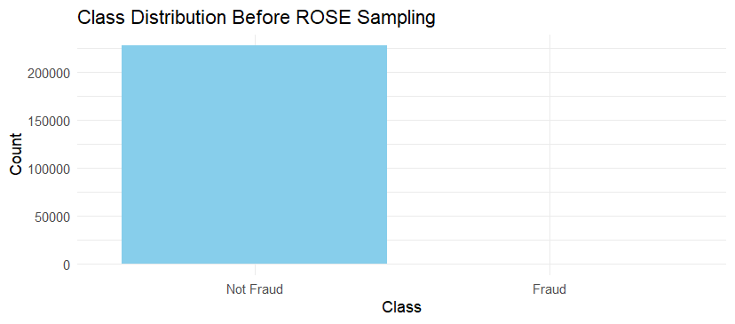
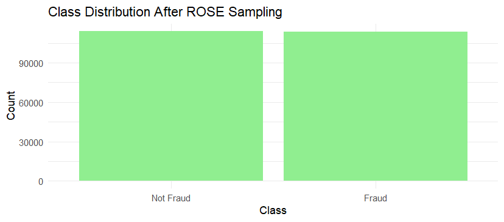
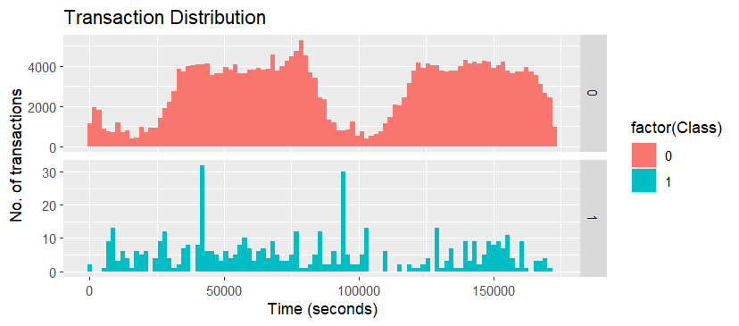

# Credit Card Fraud Detection Using Machine Learning and R programming

This project applies machine learning techniques in **R** to detect fraudulent credit card transactions. It leverages advanced classification models, threshold optimization, and a user-friendly **Shiny dashboard** for real-time evaluation and visualization.

---

## Project Overview

Detecting credit card fraud is a critical challenge due to the rarity of fraudulent transactions and the high cost of false negatives. This project addresses the issue using supervised machine learning models on a highly imbalanced dataset, with a focus on improving classification performance through:

- Class imbalance handling (fraud cases are rare).
- Decision threshold tuning
- Comparative model evaluation for better fraud detection.

---

## Dataset

- **Source**: [Kaggle Credit Card Fraud Detection Dataset](https://www.kaggle.com/datasets/mlg-ulb/creditcardfraud)
- **Size**: 284,807 transactions
- **Fraudulent cases**: 492 (~0.17%)
- **Features**: 30 (28 anonymized principal components via PCA + Time and Amount)

---

## Features

- **Train and evaluate multiple models**:

  - Logistic Regression
  - Decision Tree
  - Random Forest
  - XGBoost

- **Class imbalance handling**:

  - ROSE (Random OverSampling Examples)

- **Model evaluation**:

  - ROC Curve and AUC comparison
  - Recall (True Positive Rate)
  - Precision

- **Shiny App** to interactively:
  - Train models
  - Set custom thresholds
  - Visualize ROC curve, predictions, and confusion matrix

---

## Threshold Tuning

Instead of using a fixed threshold (0.5), we analyze the **ROC curve** to find an optimal threshold that balances sensitivity (recall) and specificity.

> **Optimized Threshold Found**: 0.01496
> This improves detection of the minority (fraud) class by reducing false negatives and maximizing F1 score.

---

## Screenshots

       

---

## Packages Used

- **Language**: R
- **Dashboard**: Shiny

### Modeling

- `caret`
- `ranger`
- `xgboost`
- `rpart`

### Imbalance Handling

- `ROSE`

### Visualization

- `ggplot2`
- `ROCR`
- `pROC`

### Data Manipulation

- `dplyr`
- `data.table`

---

## Project Structure

```text
credit-card-fraud-detection/
├── Data/
├── Scripts/
├── Shiny App/
├── plots/
├── README.md
```

---

## Authors

**Puneeth Kondarasi**  
**Karnam Gagan**
