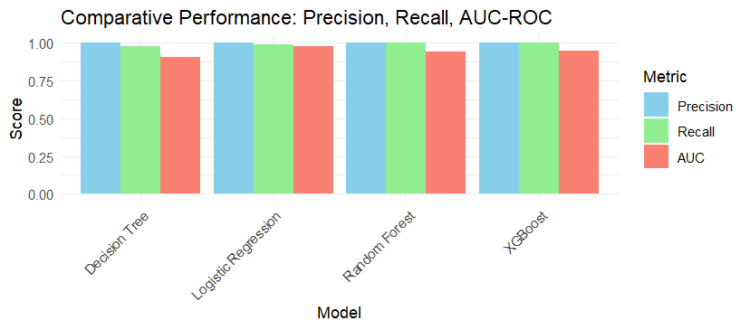

# Credit Card Fraud Detection Using Machine Learning and R programming

This project applies machine learning techniques in **R** to detect fraudulent credit card transactions. It leverages advanced classification models, threshold optimization, and a user-friendly **Shiny dashboard** for real-time evaluation and visualization.

---

## Project Overview

Detecting credit card fraud is a critical challenge due to the rarity of fraudulent transactions and the high cost of false negatives. This project addresses the issue using supervised machine learning models on a highly imbalanced dataset, with a focus on improving classification performance through:

- Class imbalance handling (fraud cases are rare)
- Decision threshold tuning
- Comparative model evaluation for better fraud detection

---

## Dataset

- **Source**: [Kaggle Credit Card Fraud Detection Dataset](https://www.kaggle.com/datasets/mlg-ulb/creditcardfraud)
- **Size**: 284,807 transactions
- **Fraudulent cases**: 492 (~0.17%)
- **Features**: 30 (28 anonymized principal components via PCA + Time and Amount)

> **Note**: You need to download the dataset from Kaggle and place the `creditcard.csv` file in a `Data/` directory within the project folder.

---

## Features

- **Train and evaluate multiple models**:
  - Logistic Regression
  - Decision Tree
  - Random Forest
  - XGBoost

- **Class imbalance handling**:
  - ROSE (Random OverSampling Examples)

- **Model evaluation**:
  - ROC Curve and AUC comparison
  - Recall (True Positive Rate)
  - Precision

- **Interactive Shiny App** to:
  - Train models in real-time
  - Set custom thresholds
  - Visualize ROC curves, predictions, and confusion matrices
  - Make predictions on new transactions

---

## Installation & Setup

### Prerequisites
- R (version 3.6 or higher)
- RStudio (recommended)

### Required R Packages
Install the following packages in R:

```r
# Core packages
install.packages(c("dplyr", "caret", "data.table", "ggplot2"))

# Machine Learning
install.packages(c("ranger", "xgboost", "rpart", "rpart.plot"))

# Data balancing and evaluation
install.packages(c("ROSE", "pROC", "ROCR"))

# Shiny dashboard
install.packages("shiny")
```

### Dataset Setup
1. Download the dataset from [Kaggle](https://www.kaggle.com/datasets/mlg-ulb/creditcardfraud)
2. Create a `Data/` directory in the project root
3. Place the `creditcard.csv` file in the `Data/` directory

---

## Usage

### Running the Analysis Script
1. Open `Scripts/CreditCardFraud.R` in RStudio
2. Update the dataset path in line 13 to match your system:
   ```r
   dataset <- setDT(read.csv("path/to/your/Data/creditcard.csv"))
   ```
3. Run the entire script to:
   - Perform data preprocessing
   - Train all models
   - Generate performance comparisons
   - Create visualizations

### Running the Shiny Dashboard
1. Open RStudio
2. Set your working directory to the project folder
3. Run the Shiny app:
   ```r
   library(shiny)
   runApp("Shiny App/")
   ```
4. The dashboard will open in your browser where you can:
   - Train different models
   - Adjust thresholds
   - Make predictions on new transactions
   - View performance metrics

---

## Threshold Optimization

The project implements dynamic threshold optimization using ROC curve analysis. Instead of using a fixed threshold (0.5), the system finds the optimal threshold that maximizes the F1 score by balancing sensitivity (recall) and specificity.

> **Optimized Threshold Found**: 0.01496
> **Note**: The optimal threshold varies based on the model and dataset characteristics. The Shiny app automatically calculates the best threshold for each model.

---

## Screenshots

       

---

## Packages Used

- **Language**: R
- **Dashboard**: Shiny

### Modeling
- `caret` - Machine learning framework
- `ranger` - Random Forest implementation
- `xgboost` - Gradient boosting
- `rpart` - Decision trees

### Imbalance Handling
- `ROSE` - Random OverSampling Examples

### Visualization
- `ggplot2` - Data visualization
- `ROCR` - ROC curve analysis
- `pROC` - ROC curve plotting

### Data Manipulation
- `dplyr` - Data manipulation
- `data.table` - Fast data operations

---

## Project Structure

```
P01 Credit Card Fraud Detection/
├── Data/
│   └── creditcard.csv
├── Scripts/
│   └── CreditCardFraud.R
├── Shiny App/
│   ├── server.R
│   └── ui.R
├── Plots/
│   ├── Data_Balancing_1.png
│   ├── Data_Balancing_2.png
│   ├── Data_Preprocessing_1.png
│   ├── Performance_Metrics.png
│   ├── ROC_Logistic.png
│   ├── ROC_Decision_Tree.png
│   ├── ROC_Random_forest.png
│   └── ROC_XGBoost.png
├── Credit Card Fraud Detection Markdown.pdf
└── README.md
```

## Authors

**Puneeth Kondarasi**  
**Karnam Gagan**

---